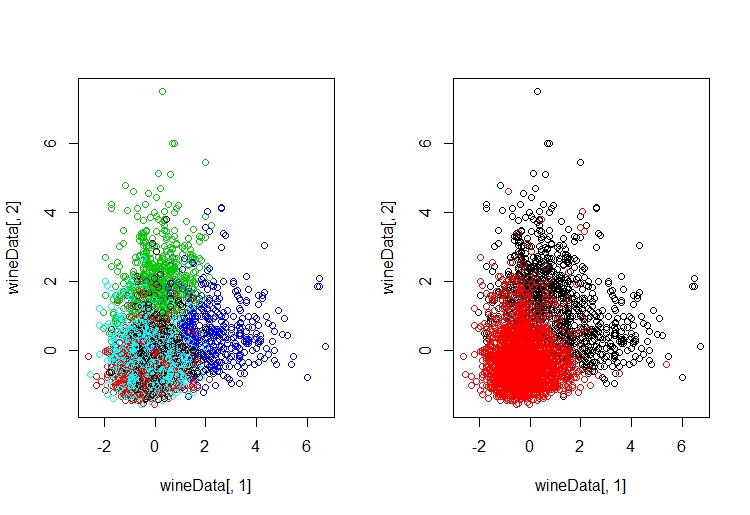

##Question 3 of Homework 1

####Objective
Use Clustering and PCA to evaluate the best way to describe different wines based on their chemical attributes. (Classify into Red or White and also the quality)

####Conclusion
 
 - The K-Means clustering approach allowed me the ability to group wines with similar colours based on their chemical components with a relatively high accruacy. K=5 allowed from 95-99% accuracy for determining if a wine was red or white whereas K=10 ranged from 88-99% so it was less accurate.
    
    - Quality was not as effective, around 50% accuracy determineing the wine's quality rating. I believe this was caused because of K-Means' limitation to be able to cluster effectively when clusters are different sizes.

 - Principal Component Analysis was able to capture 95% of the varaince from the original data however because of the high number of dimensions to plot based on, it was difficult to be able to plot the information from this analysis.
 
 - My conclusion is clustering creates a much more intepretable result. I would recommend using K-Means to cluster the wines to predict their color. Quality is much more difficult given the amount of categories each can be in.

####Format for my report
Ive "stepped" through each part of my code below for both Clustering and PCA including a snap shot of the code itself. After the steps I provide the executable code with charts and tables to show.


####Clustering
Step 1: Import the mosaic and ggplot2 library
```
library(mosaic)
library(ggplot2)
```
Step 2: Read in the data and scale the numerical attributes
```
rawdata = read.csv('wine.csv', header=TRUE)

wineData = scale(rawdata[,1:11]) #Scale the data
wineData = cbind(wineData,rawdata[,12:13])
```

Step 3) What I did next was run a for loop to find the best number of clusters to decrease my total within cluster sum of square distances. I was careful to not go with a K number that was too high. The resulting plot for testing K=1 to K=10 is below the code. My decision for K was to use 5 centroids because that is the "knee" of the plot. I tried using Bayesian Information Criterion to determine the optimal K, but the BIC function I was using took upwards of 30 minutes to run so I decided to decide this the "dumb" way, knee.

```
#Find a K number that will lead to the 
numK = 10
SSEArray = rep(0,numK)
#BICArray = rep(0,numK)
for(i in 1:numK){
  wineCluster = kmeans(wineData[1:11],centers = i, nstart = 10)
  SSEArray[i] = wineCluster$tot.withinss
}
plot(SSEArray)
```

Step 5) I then perform the K Means for 5 centroids and plot the data in a barchart showing each cluster's count split apart by red and white color wine classification provided. 

 - I do run a K-Means of 10 centroids here as well specifically to show percent accuracy in predicting the Red vs White wine color. You can see here that the percent accuracy for 5 centroids was consistently higher across all clusters as opposed to K=10.
 
 - The reason I did not do a scatter plot is because as you can see from one of the images I saved of a scatter plot, there does appear to be seperation, but we cant say for certain that one cluster does not overlap the other (Red vs White is on the right, Clusters K=5 is on the left)


```
#Performing K-means and plotting
numK = 5

for(r in c(10,5)){
numK = r
ClusterAll = kmeans(wineData[1:11], centers=numK, nstart=10)

finalwine = cbind(wineData, ClusterAll$cluster)
finalwine = finalwine[,c(13,14)]
names(finalwine)[2]<-'cluster'

qplot(cluster, data=finalwine, geom="bar", fill=as.factor(cluster)) + facet_wrap(~ color, ncol = 6)

#Calculating the percent accuracy at guessing the color of wine per cluster

ResultsTable = table(finalwine)
red = rep(0,numK)
count = 1
for(i in seq(1,numK*2,2)){
  red[count] = ResultsTable[i]/sum(ResultsTable[i],ResultsTable[i+1])
  count = count+1
}

white = rep(0,numK)
count = 1
for(i in seq(1,numK*2,2)){
  white[count] = ResultsTable[i+1]/sum(ResultsTable[i],ResultsTable[i+1])
  count = count+1
}

ColorAccuracy = rbind(red,white)
print('Color Accuracy')
print(ColorAccuracy)

}
```
Step 6) Finally, to see how well I classified each quality rating provided by the experts, I did a similar thing that I did to color. The table below shows centroids of 5 and 10 for my K-Means evaluation however in both cases the accuracy was at best 40-50%

```
##Calculate the accuracy of quality clustering
for(r in c(5,10)){
  numK = r
  ClusterAll = kmeans(wineData[1:11], centers=numK, nstart=10)
  
  names(ClusterAll)
  
  finalwine = cbind(wineData, ClusterAll$cluster)
  finalwine = finalwine[,c(12,14)]
  names(finalwine)[2]<-'cluster'
  
  qplot(cluster, data=finalwine, geom="bar", fill=as.factor(cluster)) + facet_wrap(~ quality, ncol = 6)
  
  #Calculating the percent accuracy at guessing the color of wine per cluster
  
  ResultsTable = as.data.frame(table(finalwine))
  
  QualityAccuracy = c('Quality 1','Quality 2','Quality 3','Quality 4','Quality 5','Quality 6','Quality 7','Quality 8','Quality 9','Quality 10')
  for(x in 1:9){
    cluster = rep(0,numK)
    for(y in 1:numK){
      cluster[y] = with(ResultsTable,sum(ResultsTable[quality==x & cluster==y,'Freq']))/with(ResultsTable,sum(ResultsTable[cluster==y,'Freq']))
    }
    QualityAccuracy = rbind(QualityAccuracy,t(as.data.frame(cluster)))
  }
  rownames(QualityAccuracy) = c('Names',1,2,3,4,5,6,7,8,9)
  print('K')
  print(numK)
  print(QualityAccuracy)
  }
```

The Code for K-Means clustering is below with charts.

```{R plot, fig.width=5, fig.height=4, message=FALSE}
library(mosaic)
library(ggplot2)
rawdata = read.csv('wine.csv', header=TRUE)

set.seed(1)
wineData = scale(rawdata[,1:11]) #Scale the data
wineData = cbind(wineData,rawdata[,12:13])

#Find a K number that will lead to the 
numK = 10
SSEArray = rep(0,numK)
#BICArray = rep(0,numK)
for(i in 1:numK){
  wineCluster = kmeans(wineData[1:11],centers = i, nstart = 10)
  SSEArray[i] = wineCluster$tot.withinss
}
plot(SSEArray)

#Performing K-means and plotting
numK = 5

for(r in c(5,10)){
numK = r
ClusterAll = kmeans(wineData[1:11], centers=numK, nstart=10)

finalwine = cbind(wineData, ClusterAll$cluster)
finalwine = finalwine[,c(13,14)]
names(finalwine)[2]<-'cluster'

qplot(cluster, data=finalwine, geom="bar", fill=as.factor(cluster)) + facet_wrap(~ color, ncol = 6)

#Calculating the percent accuracy at guessing the color of wine per cluster

ResultsTable = table(finalwine)
red = rep(0,numK)
count = 1
for(i in seq(1,numK*2,2)){
  red[count] = ResultsTable[i]/sum(ResultsTable[i],ResultsTable[i+1])
  count = count+1
}

white = rep(0,numK)
count = 1
for(i in seq(1,numK*2,2)){
  white[count] = ResultsTable[i+1]/sum(ResultsTable[i],ResultsTable[i+1])
  count = count+1
}

ColorAccuracy = rbind(red,white)
print('Color Accuracy')
print(ColorAccuracy)

}

print('K=5 bar chart')
qplot(cluster, data=finalwine, geom="bar", fill=as.factor(cluster)) + facet_wrap(~ color, ncol = 6)

##Calculate the accuracy of quality clustering
for(r in c(5,10)){
  numK = r
  ClusterAll = kmeans(wineData[1:11], centers=numK, nstart=10)
  
  names(ClusterAll)
  
  finalwine = cbind(wineData, ClusterAll$cluster)
  finalwine = finalwine[,c(12,14)]
  names(finalwine)[2]<-'cluster'
  
  qplot(cluster, data=finalwine, geom="bar", fill=as.factor(cluster)) + facet_wrap(~ quality, ncol = 6)
  
  #Calculating the percent accuracy at guessing the color of wine per cluster
  
  ResultsTable = as.data.frame(table(finalwine))
  
  QualityAccuracy = c('Quality 1','Quality 2','Quality 3','Quality 4','Quality 5','Quality 6','Quality 7','Quality 8','Quality 9','Quality 10')
  for(x in 1:9){
    cluster = rep(0,numK)
    for(y in 1:numK){
      cluster[y] = with(ResultsTable,sum(ResultsTable[quality==x & cluster==y,'Freq']))/with(ResultsTable,sum(ResultsTable[cluster==y,'Freq']))
    }
    QualityAccuracy = rbind(QualityAccuracy,t(as.data.frame(cluster)))
  }
  rownames(QualityAccuracy) = c('Names',1,2,3,4,5,6,7,8,9)
  print('K')
  print(numK)
  print(QualityAccuracy)
  }
```


####Principal Component Analysis

Step 1) First we read in the data again and remove the quality and color for our analysis

```
#Reimporting the data
rawdata = read.csv('wine.csv', header=TRUE)

#Remove color and quality rating
workingData = rawdata[,1:11]
```

Step 2) I center but dont scale the data here because of what was mentioned in class. 
```
#Centering the data but not scaling
centeredData = scale(workingData, center=TRUE, scale=FALSE)
```

Step 3) I then use the prcomp() function to calculate the principal components (v)
```
#Calculating the principal components and extracting PC1
PC1 = prcomp(centeredData)
v_best = PC1$rotation[,1]
```

Step 4) Calculate the alpha (scalar score) of the projections by doing the innerproduct of the centered datapoints against the vector domain
```
#inner product of x and v (PC1) gives us the alpha, the scalar score, of each projection
alpha_best = centeredData %*% v_best
```

Step 5) Finally to find out how much information our PC1 captured in terms of variance of the data, I calculate the variance of each piece of data and divide the variance of the alphas against that.
```
#Calculating the amount of variance captured
varofdata = apply(centeredData,2,var)
print(var(alpha_best)/sum(varofdata))
```

Below is the code for PCA, the output is the percent of variance captured by PC1. Because there were so many dimensions I was not sure what I could have plotted.

```{R, message=FALSE}
#Reimporting the data
rawdata = read.csv('wine.csv', header=TRUE)

#Remove color and quality rating
workingData = rawdata[,1:11]

#Centering the data but not scaling
centeredData = scale(workingData, center=TRUE, scale=FALSE)

#Calculating the principal components and extracting PC1
PC1 = prcomp(centeredData)
v_best = PC1$rotation[,1]

#inner product of x and v (PC1) gives us the alpha, the scalar score, of each projection
alpha_best = centeredData %*% v_best

#Calculating the amount of variance captured
varofdata = apply(centeredData,2,var)
print('Amount of variance captured')
print(var(alpha_best)/sum(varofdata))
```


