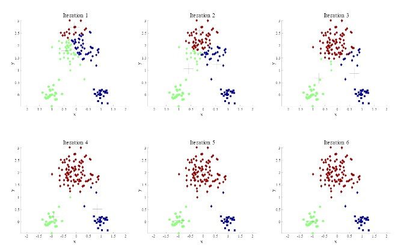
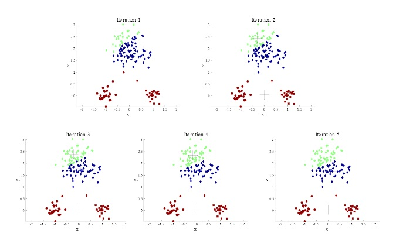
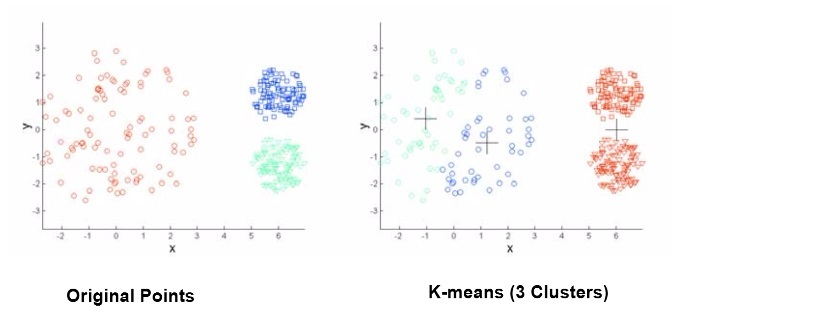
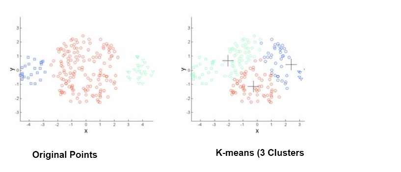
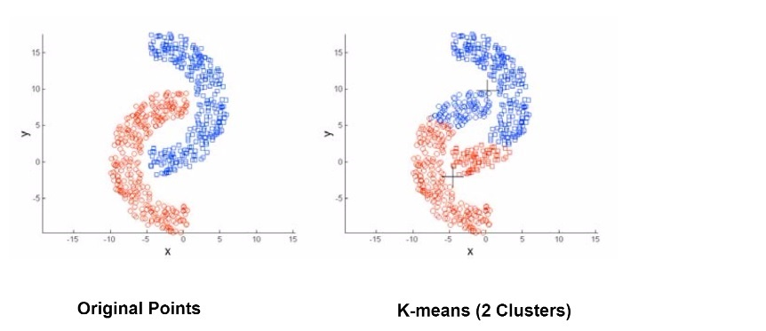

##K-Means Clustering

###What is Clustering?
 - Clustering is the grouping of objects based on variables that are determined to be "similar" to one another
 - Humans can typically do this visually if there are a small number of dimensions

###What is K-Means Clustering?
 - Simplest, most widely used, Partitional Clustering
 - It is a flat structure, non-Hierarchical
 - The aim is to partition 'n' points into 'k' clusters

###Why K-Means?
 - K-Means is very simple both mathmatically and conceptually

###Basic Concept
 - Every point in a set is associated with a central point, a centroid
 - The association is done by determining which centroid is closest to the point
 - "Closest" is defined by you (Euclidean, Manhattan, etc)
 - The number of clusters, 'K', must be specified ahead of time
 - The end goal of K-Means clustering is to reduce the sum of square errors for each point of the cluster (Equations for SSE and Variance are below)

#####Sum of Square Errors

$$m_j =  \frac{\sum_{X_i \epsilon C_j} X_i}{N_j}$$

$$SSE = \sum_{j = 1}^{k} \sum_{X_i \epsilon C_j} d(x_i,m_j)^2 = \sum_{i=1}^{k} d(x_i,m_{a_i})^2$$

#####Variance of a cluster

$$V_j = \frac{1}{N_j} \sum_{X_i \epsilon C_j} d(x_i,m_j)^2$$

###Notation

$N_j = \mid C_j \mid$

$m_j$ is the centroid of the cluster j

$a_j$ is the cluster ID of the data point j 

$c_j$ is the set of i (observations) such that $a_i = j$

###Algorithm
 - Select K points as the initial centroids
 - Repeat the following until nothing changes
    - Assign each point to the nearest centroid
    - Re-compute the cluster centroids
 - Once the centroids stop changing with each iteration you have found the local optima

###Properties
 - Starting points for K-Means significantly impacts the final cluster output
 - Typically the cluster centroid is defined as the mean of the points within the cluster
 - Complexity of K-Means
    - Calculated as the product of NKDI, where...
        - N = sample size
        - K = number of clusters
        - D = number of dimensions
        - I = number of iterations

###Probability of an Ideal Cluster Assignment
 - Given that the starting point will greatly impact the final cluster you can repeat the K-Means clustering X times to attempt to find the most optimal cluster
 - If there are K real clusters, the probability of selecting one centroid for each of those clusters is very small (Equation is Below)
$P(ideal) = \frac{k!n^k}{k*n} = \frac{k!}{k^k}$

###Examples of Good and Bad Centroid Starting Points
 - Shown below is the result of K-Means with a good centroid starting points
    - Each graph is one iteration of the clustering algorithm
    
    

 - Shown below is the result of K-Means with a bad centroid starting points
 
 
 

###K-Means Trade-Offs
 - K-Means can "mess up" often
    - Because of its simplicity the K-Means algorithm can choose the incorrect clusters often
    - High dependence on centroid starting points
 - Characteristics of the objects that will impact the effectiveness of K-Means

#####Density differences
    
    

#####Size differences
    
    

#####Shape of clusters
    
    
